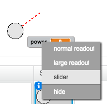
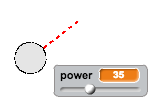

## Making a snowball

Let's make a snowball, that you can throw around your stage.

--- task ---
Open the Scratch [starter project](http://rpf.io/p/en/snowball-fight-scratch2-go){:target="_blank"} in the offline editor.

If you need to download and install the Scratch offline editor, you can find it at [rpf.io/scratchoff](http://rpf.io/scratchoff){:target="_blank"}.

In the starter project, you should see a blank stage and snowball sprite.

--- /task ---

--- task ---

The 'Snowball' sprite contains 2 costumes, a normal costume, and one that shows which direction the snowball is facing.


--- /task ---

--- task ---

First, let's allow the player to change the angle of the snowball. Add this code to your snowball sprite:


```blocks
when flag clicked
wait (0.5) secs
go to x:(-200) y:(-130)
point in direction (90 v)
switch costume to [snowball-aim v]
repeat until <mouse down?>
	point towards [mouse-pointer v]
end
```

--- /task ---

--- task ---

Test out your project by clicking the green flag. You should see that your snowball follows the mouse, until you press the mouse button.


--- /task ---

--- task ---

Let's also allow the player to decide on how powerful the snowball should be thrown. Create a new variable called `power`{:class="blockdata"}.

[[[generic-scratch-add-variable]]]

--- /task ---

--- task ---

Drag your new variable display to the bottom of the stage, near the snowball. Right-click on the variable display and click 'slider'.



--- /task ---

--- task ---

Add code to set your new `power`{:class="blockdata"} variable to 0 when the flag is clicked.


```blocks
when flag clicked
+ set [power v] to (0)
```

--- /task ---

--- task ---

Now that you have a `power`{:class="blockdata"} variable, you can increase the power of the snowball _after_ the direction has been chosen with this code:


```blocks
repeat until <mouse down?>
	point towards [mouse-pointer v]
end
+repeat until < not <mouse down?> >
	change [power v] by (1)
	wait (0.1) secs
end
```

This code means that you have to _keep the mouse button held down_ after choosing the direction, to choose the snowball's power.

--- /task ---

--- task ---

Test your snowball, to see if you can choose its angle and power.



--- /task ---
