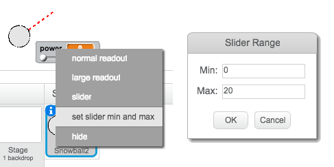

## Realistic movement

You now have a snowball, but let's make it move a bit more realistically.

--- task ---

First, let's set a maximum power level, so that the snowball can't be thrown too hard.

In your snowball's `when flag clicked`{:class="blockevents"} code, we need to increase the power only if it's less than 20. Change your code to:


```blocks
repeat until< not <mouse down?> >
+	if < (power) < [20] > then
		change [power v] by (1)
		wait (0.1) secs
	end
end
```

--- /task ---

--- task ---

Test out your snowball again, and you'll see that the power never gets above 20.

--- /task ---

--- task ---

Now that your snowball's maximum power is 20, you can set this as the maximum value for the variable's slider too. Right-click on your power variable, and click 'set slider min and max'.




--- /task ---

--- task ---

You can also slow down the snowball, by reducing the power slightly as it flies through the air. Add this code block to your snowball's `when I receive [throw]`{:class="blockevents"} code:


```blocks
when I receive [throw v]
switch costume to [snowball v]
repeat until < touching [edge v]? >
	move (power) steps
+	change [power v] by (-0.25)
end
hide
```

--- /task ---


--- task ---

Test this new code - does it work as you expected? You may notice that the power keeps reducing, and eventually the snowball moves backwards!

To fix this, you can add an `if`{:class="blockcontrol"} block to your code, so that the power is only lowered if it is above 0:


```blocks
if < (power) > (0) > then
	change [power v] by (-0.25)
end
```

--- /task ---

--- task ---

You're nearly there, but you also need to add some gravity to your snowball, so that it falls to the ground. You can add gravity by just moving the snowball down continuously with this script:


```blocks
when I receive [throw v]
repeat until <touching [edge v]?>
	change y by (-5)
end
```

--- /task ---

--- task ---

Test out your snowball again, and you should see that your snowball moves much more realistically.

--- /task ---

